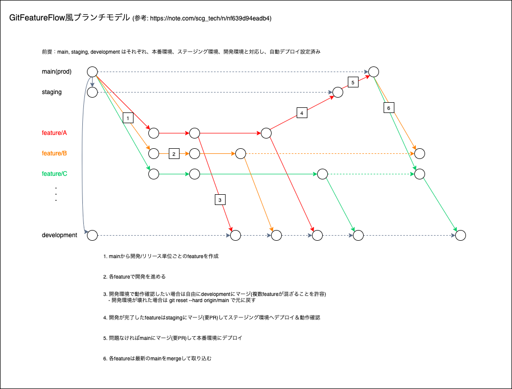

# Terraform GitOps

Terraform で GitOps に対応させたサンプルリポジトリ

- main、stagingにmergeされたら自動的にデプロイする
  - Gitで管理されているIaC = 実際のリソースとするため
  - merge前のPRでレビューと自動テスト(tfsec)を必須とする
  - stagingで問題がないことを確認してから、mainにマージする
- developmentは手動で`terraform deploy`を使ってデプロイする
  - 複数featureが混ざることは許容する
    - 各feature単位でのチェックはstagingで行う
  - 開発環境が壊れた場合は`git reset --hard origin/master`

## ブランチモデル



### ブランチ保護設定

```txt
GitHub
-> Settings
-> Branches
-> Branch protection rules
-> Add branch protection rule
```

Branch name pattern: `main, staging`

Protect matching branches

- [x] Require a pull request before merging
  - [x] Require approvals
  - [x] Dismiss stale pull request approvals when new commits are pushed
- [x] Require conversation resolution before merging

※ 必要に応じて設定を追加すること

## 各IAMロールに割り当てる権限

最小権限とする場合は以下が参考になりそう

[Pikeを使ってTerraform実行ユーザー用の最小限のIAMポリシーを生成する](https://dev.classmethod.jp/articles/pike-terraform-generate-iam-policy/)

### 本番、ステージング環境

- GitHub Actions: AdministratorAccess
- 開発PC: ReadOnlyAccess

### 開発環境

- 開発PC: AdministratorAccess

## 環境設定

```bash
brew install asdf
asdf plugin add awscli
asdf plugin add terraform
asdf plugin add tflint
asdf plugin add tfsec
asdf plugin add pre-commit
asdf install
pre-commit install
```

## 参考

- [GitFeatureFlow風ブランチ運用がうまくハマって、少しずつズレてきた。そんなブランチ運用の話](https://note.com/scg_tech/n/nf639d94eadb4)
- [[AWS × Terraform] plan できるけど apply できない GitOps な IAM ユーザーポリシーの設定方法](https://dev.classmethod.jp/articles/terraform-iam-policy-not-apply-but-plan/)
